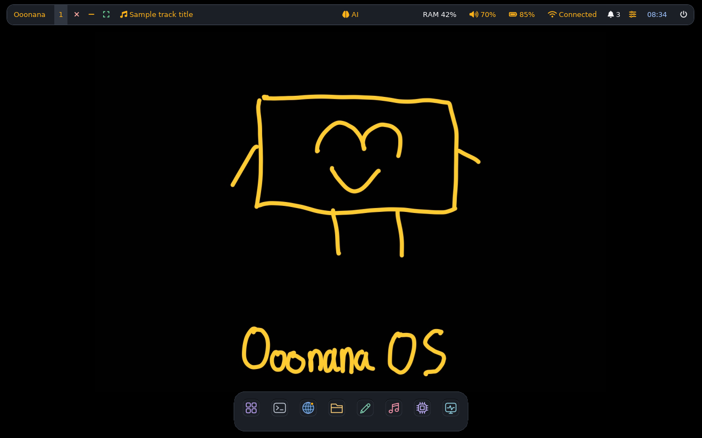
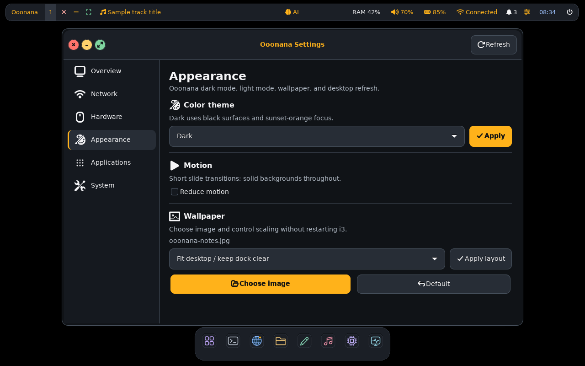
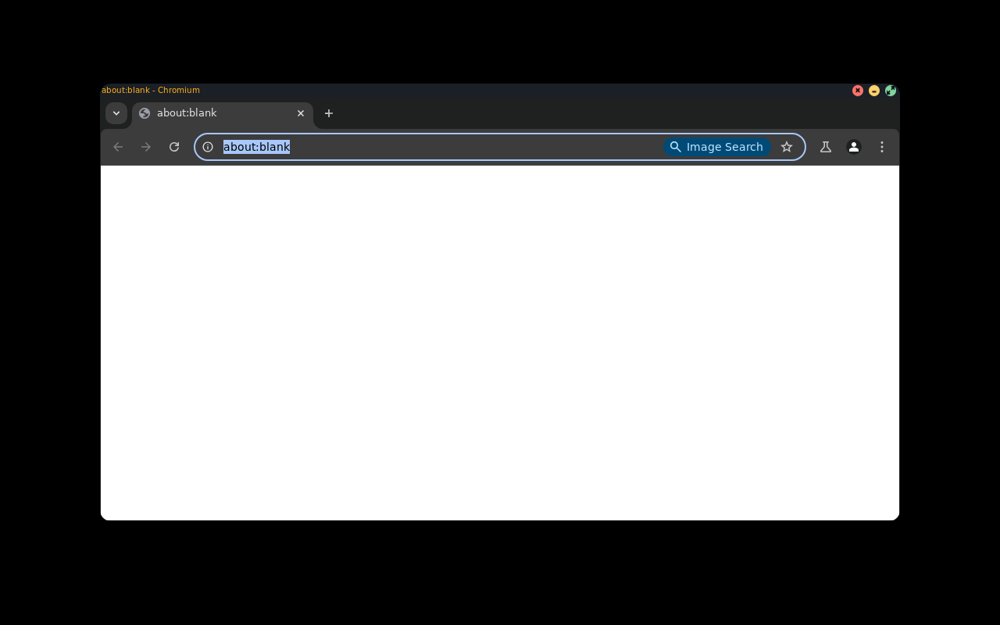
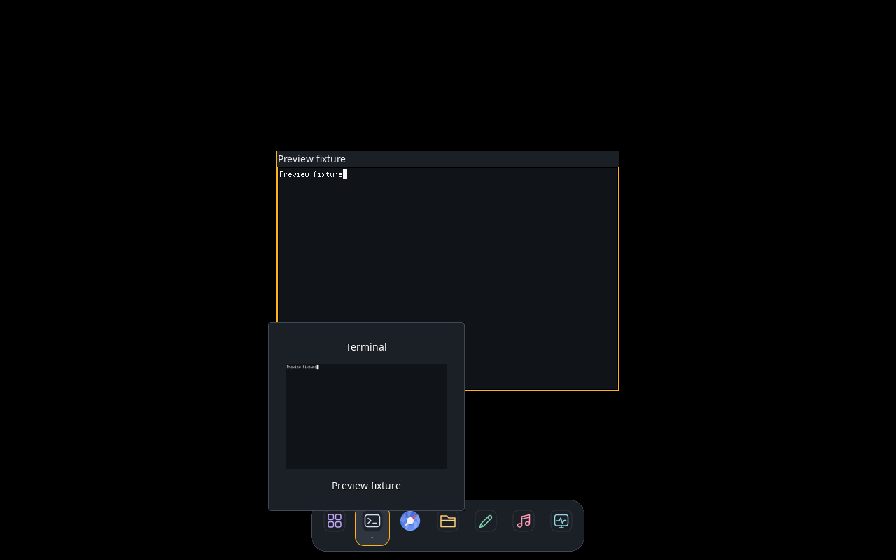
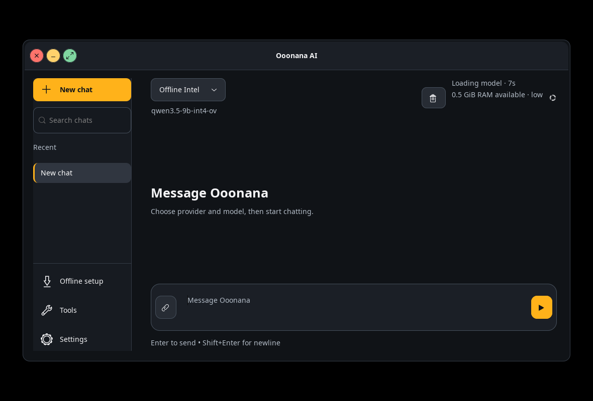
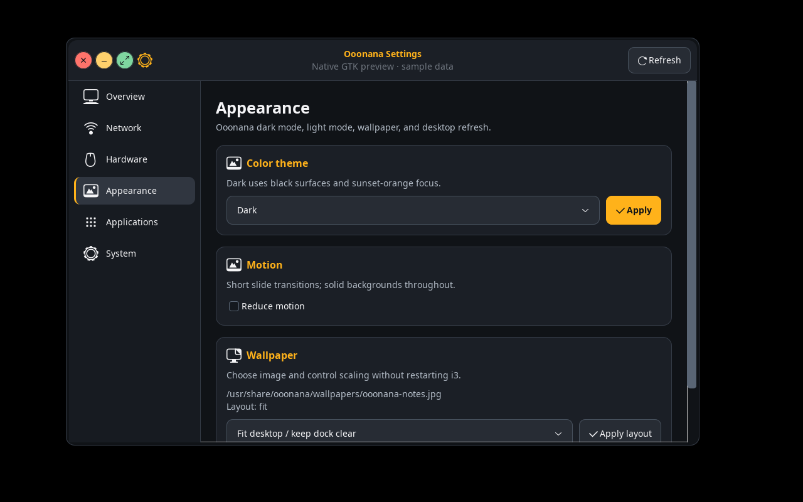
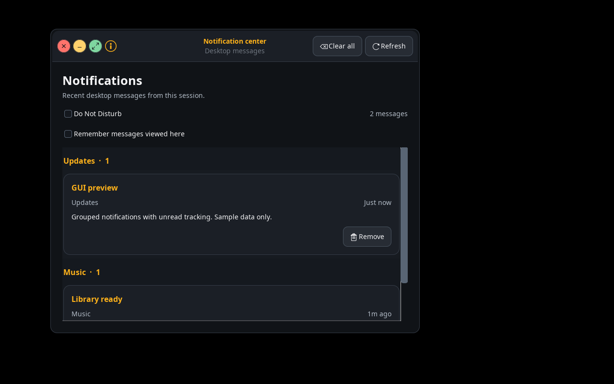
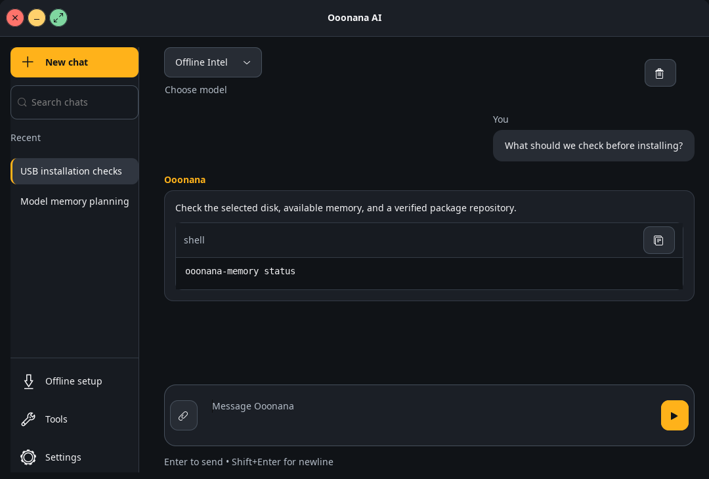

# Ooonana OS

```
Ooonana OS
      __________________
     |    __      __    |
     |   /  \    /  \   |
   / |                  |\
  /  |     \______/     | \
     |__________________|
          |        |
```

Ooonana OS is a custom Linux distribution built from scratch around its own boot flow, init path, installer, desktop integration, package manager, and package repository. It targets lightweight operation, low overhead, responsive desktop performance, and AI-first local or cloud-assisted work.

Ooonana is not a Debian, Ubuntu, Alpine, or Arch derivative. It uses upstream Linux, BusyBox, GRUB, i3, and other open-source components. Ooonana package factory currently imports selected Alpine package payloads into Ooonana `.pkg` repositories while native packages replace them over time.



October 8 source desktop captured with real GTK/i3/Polybar on an isolated X11 display. Panel status uses sample data; wallpaper/dock are source assets. No audio played. Physical USB visuals require a fresh image. Earlier WSL screenshot remains in `docs/assets/ooonana-full-i3-desktop.png`.

Stable core 0.9.9 desktop refresh adds unboxed dock hover feedback, slimmer panel, open Appearance groups, blue globe browser icon and canonical wallpaper fitting. Component previews use isolated test windows, not physical USB boot.

This branch stages **core 0.10.0**, a coherent Alpine v3.24 imported-userland candidate. Installed Ooonana WSL and stable package channel remain 0.9.9. Candidate GTK/UI and signed repository checks passed, but new Chromium sandbox crash blocks release; WSL migration is deferred. No ISO built. See [candidate status and remaining gates](docs/supported-base-20261008.md).



See [October 8 verification and remaining gates](docs/ui-catalog-20261008.md).

### Optional common packages

Repository builds include `neofetch`, `fastfetch`, `nano`, `git`, `jq`, `zip`, `unzip`, `ripgrep`, `tmux`, `btop`, `tree`, `ncdu`, `less`, `lsof`, `strace`, and `openssh-client-default`. These are not added to default full-i3 install closure; availability does not mean installed in an existing ISO/WSL session.

```bash
ooonana update
ooonana get neofetch fastfetch git jq ripgrep tmux
ooonana get firefox
# Desktop user, not root; explicit network/runtime download:
ooonana-firefox setup
firefox
```

`firefox` package supplies launchers, not bundled Mozilla binaries. Browser/runtime download through the [Mozilla-documented Flatpak route](https://support.mozilla.org/en-US/kb/install-firefox-linux). Check persistent disk space first. `ooonana-firefox update` updates that user-owned browser; OS package updates do not update its Flatpak runtime automatically.

Stable 0.9.9 imported base targets Alpine 3.20, whose normal support ended April 1, 2026 ([upstream lifecycle](https://alpinelinux.org/releases/)). Candidate 0.10.0 uses one v3.24 branch and rejects mixed provenance. Never mix its libraries into live 0.9.9 systems. Candidate `neofetch` is a small native compatibility command, not the removed upstream APK; use `fastfetch` for richer reporting.




October 7 frame repair removes rectangular control-popup backing and clipped orange perimeter outlines. Orange focused title text remains; controls stay opaque. Current screenshot uses private Chromium profile, nested i3 and packaged xrender rounding policy with software browser rendering, not physical GPU validation. Geany/Nemo/Chromium window actions passed; remaining desktop checks are listed in [frontend coverage](docs/frontend-recheck-20261007.md).





Dock previews stay in RAM and never restore or focus hidden windows. Compact panel controls remain accessible through windows, dock menus and Control Center. AI shows elapsed time, not invented progress percentages; available RAM respects cgroup limits and excludes swap.

Latest source recheck hardens Music session matching and fixes panel reload isolation, display-scoped window-control locks, duplicate native dialog titlebars, bounded/sanitized Wi-Fi names and Unicode-safe music titles. Isolated GTK/i3 and bundled Polybar checks passed. User's October 6 ISO build passed service/desktop smoke and BIOS/UEFI VM gates; physical USB validation remains manual. Details: [current work](docs/current-work.md#user-build-cleanup-and-installed-wsl-sync).

October 7 follow-up fixes misleading page titles stealing dock groups, recognizes current OpenVINO desktop titles, and adds bounded panel/dock crash recovery. WSL source sync now uses guarded same-version package transactions; fix/reinstall cannot bypass major-upgrade approval. Current WSL is synchronized and focused GUI/backend regressions passed. October 6 ISO does not contain these later functional repairs; build a fresh image. Details: [follow-up checks](docs/current-work.md#guibackend-follow-up).

Latest GUI polish previews, rendered from real GTK widgets in an isolated virtual display with sample data:







AI preview uses fixture messages, not an inference result. Native chat adds searchable private conversations, message bubbles, code copying, text attachments, Enter/Shift+Enter controls, and cancellable requests. Stopping a request does not stop the shared local API. History retains at most 60 chats / 120 messages per chat using private atomic writes, targeting 8 MiB by dropping the oldest whole chats; a single chat can exceed that target. Unreadable old history stays untouched. Failed saves preserve the last committed record and can retry on a later save.

## Quick Links

- [Download / Release Files](#download--release-files)
- [What Ooonana Is](#what-ooonana-is)
- [Current Status](#current-status)
- [Install And Test](#install-and-test)
- [Ooonana Command](#ooonana-command)
- [Package Factory](#package-factory)
- [Full I3 Edition](#full-i3-edition)
- [Rufus USB](#rufus-usb)
- [Ooonana AI](#ooonana-ai)
- [Build From Source](#build-from-source)
- [Project Files](#project-files)

## Download / Release Files

Latest GitHub release:

```text
https://github.com/Ooonana/Ooonana-OS/releases/tag/v0.1.8-ui-hardware
```

Current release artifacts on this machine live in:

```text
F:\Ooonana\ooonana-os\release-current
/mnt/winf/Ooonana/ooonana-os/release-current
```

For direct WSL access to F:, mount it at `/mnt/winf`:

```bash
sudo mkdir -p /mnt/winf
sudo mount -t drvfs F: /mnt/winf
```

Main full-i3 live/install ISO:

```text
F:\Ooonana\ooonana-os\release-current\ooonana-full-i3.iso
/mnt/winf/Ooonana/ooonana-os/release-current/ooonana-full-i3.iso
```

GitHub release download is split because GitHub rejects single release assets over 2 GiB:

```text
ooonana-full-i3.iso.part01
ooonana-full-i3.iso.part02
ooonana-full-i3.iso.part03
ooonana-full-i3.iso.part04
ooonana-full-i3.iso.part05
REASSEMBLE.txt
SHA256SUMS.full-i3
```

Reassemble on Windows:

```powershell
copy /b ooonana-full-i3.iso.part01+ooonana-full-i3.iso.part02+ooonana-full-i3.iso.part03+ooonana-full-i3.iso.part04+ooonana-full-i3.iso.part05 ooonana-full-i3.iso
Get-FileHash -Algorithm SHA256 .\ooonana-full-i3.iso
```

Last built full-i3 ISO SHA256 (September 25, 2026; predates current desktop source):

```text
1e9f6aeceb6be45f9b2625688275b2b2aa8a24aaaacb4983797344d0ff65eef3
```

Minimal scratch installer ISO:

```text
/var/tmp/ooonana-os/release/ooonana-scratch.iso
```

Live environment status:

```text
ooonana-full-i3.iso    live desktop by default, persistent live second, installer third
ooonana-scratch.iso    minimal shell plus installer menu
full-i3 live desktop   i3, rounded top panel and app dock, rofi, Notes wallpaper
full-i3 install menu   live GUI installer session, VGA-first fallback, safe graphics fallback
rufus usb              ISO mode, BIOS/UEFI, Secure Boot off
rufus persistence      second GRUB entry; first-boot storage-file setup, or OOONANA_PERSIST partition
full-i3 VM RAM         2048 MB boot smoke only; local AI needs more physical RAM
live kernel            Linux 6.18.37 with Ooonana responsiveness and Galaxy Book support
```

Release files:

```text
ooonana-scratch.iso                minimal installer-only GRUB ISO
ooonana-scratch-disk.raw           minimal installed raw disk image
ooonana-rootfs.tar.gz              minimal chroot/container rootfs tarball
ooonana-wsl-rootfs.tar.gz          minimal WSL import rootfs
ooonana-full-i3-rootfs.tar.gz      full-i3 package-installed rootfs tarball
ooonana-full-i3-disk.raw           full-i3 installed raw disk image
ooonana-full-i3.iso                full-i3 live/install ISO, embeds compressed install disk
ooonana-full-i3-wsl-rootfs.tar.gz  full-i3 WSL import rootfs
vmlinuz-ooonana                    Ooonana Linux kernel
SHA256SUMS                         checksums for release artifacts
SHA256SUMS.full-i3                 checksums for full-i3 artifacts
qemu-rootfs-boot.log               direct rootfs QEMU boot proof
qemu-scratch-ext4-boot.log         minimal ext4 disk QEMU boot proof
qemu-installer.log                 installer ISO QEMU proof
qemu-iso-fallback-shell.log        installer failure shell proof
qemu-installed-boot.log            installed disk QEMU proof
qemu-full-i3-gui-smoke.log         full-i3 Xorg/i3 serial proof
qemu-full-i3-live.log              full-i3 live ISO boot proof
qemu-full-i3-live-iso.log          full-i3 live ISO boot proof
qemu-full-i3-uefi-installer.log    full-i3 UEFI installer proof
qemu-full-i3-installer-vmware.log  full-i3 VMware-style installer proof
qemu-full-i3-installed-sata.log    full-i3 VMware-style installed boot proof
qemu-full-i3-vnc.log               full-i3 VNC boot proof
qemu-full-i3-vnc.png               full-i3 VNC screenshot proof
```

Verify files:

```bash
cd /mnt/winf/Ooonana/ooonana-os/release-current
sha256sum -c SHA256SUMS
sha256sum -c SHA256SUMS.full-i3
```

## What Ooonana Is

Ooonana OS is a scratch-built Linux distribution. Target system has Ooonana identity, init, tools, package database, repositories, desktop policy, installer, and release pipeline. Debian/Ubuntu remain host build environments only. Selected Alpine binaries enter through Ooonana package conversion, dependency indexing, checksums, and repository metadata rather than Alpine package management.

Design targets:

- Lightweight base with minimal background work
- Performance-focused kernel and responsive i3 desktop
- AI-ready Python, provider routing, task tools, and native AI workspace
- Own `ooonana` package lifecycle and cloud repository
- BIOS, UEFI, Rufus ISO-mode, QEMU, VMware, WSL, and real-hardware paths
- Explicit install boundaries: live mode does not modify internal disks

Core pieces:

- Linux kernel
- BusyBox-style minimal userspace
- Custom `ooonana` package manager
- GRUB boot disk and installer ISO
- WSL rootfs export
- QEMU verification flow
- Optional AI CLI with provider routing

## Current Status

Source core 0.9.9 includes nested WSL i3, native hover-preview dock, responsive panel, AI phase/RAM/storage indicators, native and third-party window controls, tailless pointer enlarged 10% from previous defaults, matching app icons, left music, centered AI access and notification center. Third-party buttons have larger targets and exclude hidden tabs, fullscreen-covered and overlapping windows. Alt+F4 closes; Alt+F10 toggles fullscreen. User's October 6 ISO build includes current repairs, passed service/desktop smoke and BIOS/UEFI VM gates, and has a verified local checksum. Installed Ooonana WSL core/runtime and OpenVINO app payloads are synchronized; a CRLF login-environment failure is fixed. Physical USB RAM/OpenVINO and fan-sensor checks remain pending.

Core 0.9.8 fixes BusyBox builds that advertise version sorting but cannot perform it. Package-index selection and upgrades now have portable natural-version comparison, preserving first-source ties. ISO preflight rejects a missing signature when a trust key is supplied and checks that required desktop packages are actually reachable from the install profile. The core meta-package health hook preserves the empty legacy ownership manifest after migration, so runtime file checks remain valid.

The bootable `docs/ooonana.pdf` has opaque graphite terminal/keyboard cards and a blank command input with Run / Enter. The upstream one-second input-reset timer is removed, so the redundant hint cannot return during execution. Native Backspace/deletion ranges are forwarded to the real guest; virtual Backspace deletes once and updates the capture field. Its PDF-only payload excludes unsupported desktop/Python/AI files and bundles base metadata only, with consistent indexes/checksums. The unchanged real package backend, help, repository inputs and public trust keys are seeded into bounded tmpfs. Dirty rows repaint at most 20 Hz; hidden loader widgets are removed.

Boot progress now continues after kernel warnings instead of freezing at the first serial byte. Early console messages identify mount/seed/session stages; one sequential archive loads metadata and the interactive BusyBox shell into RAM. Actual shipped JavaScript passed boot/input/Backspace/version/package sync; a 500k-instruction/second Node fixture reached the prompt in 83 seconds. These are not Chromium viewer timings. Keep the PDF tab visible and wait for `ooonana#`; package list/sync can still take minutes. [Current PDF evidence and limits](docs/ooonana-pdf-os.md).

Node VM benchmarks: bare `ooonana` 35.9 -> 2.4 seconds; package help 51.8 -> 3.0 seconds; list 63.4 seconds; actual sync 51.1 seconds. These are host Node timings, not browser promises; package operations remain comparatively slow. Latest boot/stable-input/native-and-virtual-Backspace/middle-edit/arithmetic/core-version/package-sync suite passed in 90 seconds. All 116 canonical widgets/actions were reopened and checked; Chromium interaction remains manual. Desktop/ISO payloads and the docs-only guide are unchanged.

Backend pass adds verified repository generations, signed metadata, preserved custom `/etc` files, post-upgrade health checks with automatic payload rollback, retained core/kernel checkpoints, explicit major-update approval, security-update markings, and reboot status. Native **Health** and **Updates** apps provide on-demand diagnostics and upgrade review. Diskless login VM passed password rejection/authentication and UID-1000 desktop handoff; physical Xorg/hardware and model inference remain separate gates. OpenVINO Chat 0.2.1 uses complete hash-locked Linux wheels plus a pinned Ubuntu image/APT snapshot. Private signing key stays local by choice. This pass does not build an ISO.

Latest source repair handles corrupt/bounded recovery and session records, cleans failed-save temporary files, retries pending drafts without reviving superseded input, and keeps combined major/security update labels. AI preflight and status share validated cache estimates; malformed dimensions cannot produce negative cache use, and a context is not suggested unless it fits the estimate. Current-source regression and packaging checks passed; these repairs are in the user-built October 6 image. See [current work](docs/current-work.md) for test scope and remaining hardware gates.

Final backend review also protects corrupt AI knowledge/benchmark records from silent replacement, validates chunk/metric fields, refuses unknown or unreadable checkpoints, and keeps the prior index/cache when saving or refreshing documents fails. Live-storage Health now treats unreadable mode metadata as critical instead of reporting installed storage. Disposable fault tests, broad regressions and fresh ISO VM gates passed; physical hardware verification remains separate.

October 7 crash-safety follow-up adds package writer locking, synced/checksummed interrupted-update journals and explicit `ooonana recover`, with old custom configs retained. Truncated remote downloads cannot poison final caches; retries remain bounded. File-backed FAT persistence refuses dirty outer storage before writable mounting and requires backed-up offline recovery. See [update boundaries](docs/backend-update-policy.md), [persistent USB safety](docs/persistent-usb-safety.md) and [physical hardware checklist](docs/hardware-regression-checklist.md). These source changes require a fresh user-built ISO; VM faults do not certify physical USB power loss or radios/audio/GPU/fans.

Working now:

- Scratch rootfs boots in QEMU
- GRUB raw disk boots in QEMU
- Installer ISO writes Ooonana to blank disk
- Installer ISO opens a fallback shell on install failure or cancel
- Installer has a serial-safe xterm UI with logo, disk picker, user/password, hostname, theme, cloud repo picker, progress, logs, fail shell, and reboot prompt
- Live/install ISO keeps interactive prompts on the VGA console for VMware while smoke tests log through serial
- GRUB uses a solid graphite background with orange accents and a centered Ooonana logo, BIOS/UEFI hybrid support, live/install/safe graphics menus, and a persistent USB boot entry. After selection, the live initramfs keeps the larger orange logo and loading bar visible while it finds boot media, mounts the live rootfs read-only, creates a RAM or USB persistence overlay, and starts i3. Full-i3 does not force a fixed `gfxmode`; it preserves the firmware framebuffer for a clean splash handoff.
- Kernel config is tuned for desktop responsiveness: performance compiler mode, full preemption, dynamic preemption, high-resolution timers, 1000 Hz scheduler tick, scheduler autogroup, zram, and CPU/NVMe temperature sensors.
- Rufus support has an ISO-mode note inside the ISO, USB-friendly volume labels, and `scripts/verify-rufus-iso.sh`
- Full-i3 live starts eudev before Xorg and ships libinput config for PS/2 keyboard, mouse, and touchpad discovery
- Full-i3 live boot never formats internal disks. GRUB boot UUID and same-parent checks restrict writable overlays to the boot USB. Normal live uses a cleared temporary overlay there, with RAM fallback when no matching storage exists. Persistent live keeps its separate saved overlay; failed/missing storage stops in recovery instead of silently discarding changes. Only the confirmed installer target can be partitioned or formatted.
- Full-i3 runs the desktop as the unprivileged `ooonana` user (UID 1000). Administrative commands use a validated wheel-only `doas` policy.
- Full-i3 mounts `/run` and `/dev/shm` before desktop services, maps `/var/run` to `/run`, starts system D-Bus first, then starts NetworkManager and BlueZ. This runtime order supports Chromium, Wi-Fi, Bluetooth, and desktop applets from live USB and installed systems.
- Full-i3 ships an Ooonana i3 desktop: solid rounded top panel with music status, RAM gauge, workspaces, and minimize/fullscreen/close controls; centered opaque app dock with pinned icons, running dots, restore-on-click, and right-click window actions; Spotlight-style launcher; opaque rounded GTK windows; dunst notifications; Chromium, Nemo, and editor/media shortcuts. Focus changes on click, not cursor hover. Notes is the default wallpaper again; the graphite wallpaper remains selectable. Fit mode preserves aspect ratio rather than stretching.
- OoonanaTailless cursor keeps a rounded, narrow black-and-white pointer. It is drawn for this project; third-party Windows cursor-pack files are not redistributed.
- Setup, Settings, Wi-Fi, Bluetooth, Packages, AI, Task Manager, controls, and application launcher are native GTK3 apps with shared graphite/orange design and short slide transitions. Picom keeps windows opaque; shadows and fades are disabled. Panel status scripts degrade cleanly when a VM has no battery, radio, audio, or backlight hardware.
- Wi-Fi groups repeated school/campus access points by exact SSID, shows real security instead of treating missing metadata as open, retries secured BSSIDs during roaming, and supports WPA/WPA2/WPA3 Personal, OWE, WEP, and 802.1X enterprise identity/password/CA/client-certificate profiles. Wi-Fi and Bluetooth include an RSSI proximity map. Optional `3D mode` launches RuView when its CSI point-cloud runtime is installed; normal laptop adapters remain RSSI-only.
- Installed disk boots in QEMU
- `ooonana-install` can partition a raw/whole disk with optional disk swap, install to an existing root partition, mount optional same-disk home/swap/EFI partitions, format or keep selected filesystems, copy rootfs, install kernel, write GRUB, and persist user, hostname, and theme
- Generic `ooonana-rootfs.tar.gz` can be unpacked for chroot/container-style use
- Minimal and full-i3 WSL distro exports can be imported
- `ooonana` package manager has repo add/remove/doctor, repo index, checksums, install/add, remove/uninstall, purge, upgrade, fix, check, files, verify
- Minimal and full rootfs include Ooonana shell helpers: `bunana`, `clear`, installer-based `oonana` brickout game, and Ooonana neofetch logo fallback
- `ooonana update` can sync local repos, HTTP repos, and GitHub Release repo tarballs into cache
- Cloud builds include `ooonana-core`; `ooonana update && ooonana upgrade` updates CLI, native apps, services, defaults, and the `oonana` game without downloading every application archive
- Alpine `.apk` packages can be imported into Ooonana `.pkg` repos
- Full-i3 branding assets, package profiles, input drivers, package-installed rootfs, boot disk, live/install ISO, GUI installer wizard, AI desktop launcher, and real QEMU boot proof exist as a separate edition path
- First-boot setup can create the everyday account, set a password, choose DHCP/static networking or Wi-Fi, set zram and installed disk-swap policy, select theme defaults, and add the GitLab cloud package repo. Repository signing is supported when CI signing keys are configured; current public repo publishes checksums but is not yet signed.
- GitLab Pages repo is default source: `https://ooonana.gitlab.io/ooonana-repo`. Normal maintenance is `ooonana update && ooonana upgrade`; package archives download only when install or upgrade needs them.
- `ooonana-ai` supports NVIDIA NIM, Google Gemini, tools, tasks, audit, shell fallback for scratch WSL, and a full-i3 GUI app with home/actions/ask/chat/provider-model/log panels

Next work:

- Better graphical installer layout inside live desktop
- Physical USB RAM/model-load and fan-sensor validation
- Full ISO export/install polish for VMware and other hypervisors
- More first-party packages
- Newly built installed-image Xorg/login and service hardening checks
- Native RISC-V PDF Chromium viewer verification (native boot/input/version/package-sync checks passed)

Detailed numbered roadmap:

```text
docs/ooonana-roadmap.md
```

## Install And Test

Run QEMU installer from repo root:

```bash
truncate -s 512M /var/tmp/ooonana-os/install-target.raw
bash scripts/run-qemu.sh \
  --install \
  --iso /var/tmp/ooonana-os/release/ooonana-scratch.iso \
  --disk /var/tmp/ooonana-os/install-target.raw \
  --smoke
bash scripts/run-qemu.sh \
  --disk-boot \
  --image /var/tmp/ooonana-os/install-target.raw \
  --smoke
```

Boot release disk directly:

```bash
bash scripts/run-qemu.sh \
  --disk-boot \
  --image /var/tmp/ooonana-os/release/ooonana-scratch-disk.raw \
  --smoke
```

Use the generic rootfs tarball:

```bash
mkdir -p /tmp/ooonana-rootfs
sudo tar -xzf /var/tmp/ooonana-os/release/ooonana-rootfs.tar.gz -C /tmp/ooonana-rootfs
sudo mount -t proc proc /tmp/ooonana-rootfs/proc
sudo mount --rbind /sys /tmp/ooonana-rootfs/sys
sudo mount --rbind /dev /tmp/ooonana-rootfs/dev
sudo chroot /tmp/ooonana-rootfs /bin/sh
```

Import minimal WSL rootfs, optional:

```bash
bash scripts/install-wsl-distro.sh --distro OoonanaMinimal --force \
  --tarball /var/tmp/ooonana-os/release/ooonana-wsl-rootfs.tar.gz
wsl.exe -d OoonanaMinimal -- /usr/bin/ooonana me
wsl.exe -d OoonanaMinimal -- /usr/bin/ooonana ai tools
```

Import full-i3 WSL rootfs as `Ooonana`, recommended:

```bash
bash scripts/install-wsl-distro.sh --distro Ooonana --force \
  --tarball /var/tmp/ooonana-os/release/ooonana-full-i3-wsl-rootfs.tar.gz
wsl.exe -d Ooonana -- /usr/bin/ooonana me
wsl.exe -d Ooonana -- /usr/bin/start-ooonana-i3 --nested
```

WSLg shows the full i3 desktop inside a Xephyr window. `--nested` needs `xorg-server-xephyr` and uses a private X socket namespace because WSLg mounts its socket directory read-only. Normal launch starts Ooonana audio services; `OOONANA_NO_AUDIO=1` is only a test override. Close i3 with Super+Shift+E or its window close button.

## Ooonana Command

```bash
ooonana me
ooonana setup
ooonana setup --first-boot --gui
ooonana setup --user ryan --password --network dhcp --cloud-repo https://ooonana.gitlab.io/ooonana-repo --done
ooonana version
ooonana wsl status
ooonana update
ooonana sources
ooonana list
ooonana list --installed
ooonana list --upgradeable
ooonana search gui
ooonana info ai
ooonana depends gui
ooonana get gui --dry-run
ooonana install ai
ooonana files ai
ooonana verify ai
ooonana check ai
ooonana upgrade --dry-run
ooonana remove ai
ooonana uninstall ai
ooonana purge ai
ooonana fix ai --reinstall
ooonana repo add gitlab https://ooonana.gitlab.io/ooonana-repo
ooonana repo doctor
ooonana repo remove gitlab
ooonana clean --dry-run
ooonana clean
ooonana repo index /usr/lib/ooonana/repo
```

Small terminal commands:

```bash
bunana                 # exit login shell function
bunana --shutdown      # power off
bunana --restart       # reboot
clear                  # clear terminal
oonana                 # Ooonana brickout game, two-o command
neofetch               # Ooonana logo fallback
```

`oonana` starts the terminal brickout game from the installer game engine. Bricks spell `OOONANA OS`, the ball is a compact Ooonana logo sprite, and ANSI row-diff rendering repaints only changed lines for smoother play. Repeated hits build combo scoring. Controls are `a/d` or arrows to move, `p` pause, `r` restart, `1/2/3` speed, and `q` quit.

Fresh systems track the native `ooonana-core` package. Repo updates remain metadata-only; package archives download only when a package is installed or has a newer version.

Install package flow:

```bash
ooonana update                 # sync builtin and cloud repo indexes
ooonana search nano            # find package
ooonana show nano              # inspect metadata, deps, archive
ooonana get nano --dry-run     # preview install
ooonana get nano               # install package and deps
ooonana files nano             # list owned files
ooonana verify nano            # check owned files still exist
ooonana check nano             # verify one package
ooonana check                  # verify every installed package
ooonana upgrade nano           # upgrade one package
ooonana upgrade                # upgrade all installed packages
ooonana remove nano            # remove files and installed marker
ooonana uninstall nano         # remove alias
ooonana purge nano             # remove files, marker, and Ooonana config dirs
ooonana fix nano --reinstall   # resync repo and reinstall package
ooonana repo add cloud URL     # add repo source
ooonana repo doctor            # check configured repos
ooonana repo remove cloud      # remove repo source
ooonana clean                  # remove cached repo indexes and tarball extracts
```

Help is split by task so new users do not have to read one huge page:

```bash
ooonana help
ooonana usage
ooonana help packages
ooonana help get
ooonana help upgrade
ooonana help remove
ooonana help repo
ooonana help ai
ooonana help ui
```

`ooonana help` and `ooonana usage` use an apt-style command list with short command descriptions. Detailed workflows stay under the topic pages above.

`ooonana get` installs from Ooonana repos only. To bring an Alpine package into Ooonana, build or publish an Ooonana repo first with `ooonana repo build` or `scripts/build-package-repo.sh`.

Package metadata lives inside Ooonana:

```text
/usr/lib/ooonana/repo/*.pkg
/usr/lib/ooonana/repo/index.tsv
/usr/lib/ooonana/repo/SHA256SUMS
/etc/ooonana/sources.d/*.repo
/var/lib/ooonana/packages/installed
/var/cache/ooonana/index.tsv
/var/cache/ooonana/repos/NAME
```

GitLab Pages direct repo source example:

```sh
cat >/etc/ooonana/sources.d/gitlab.repo <<'EOF'
OOONANA_REPO_NAME="gitlab"
OOONANA_REPO_URI="https://ooonana.gitlab.io/ooonana-repo"
EOF

ooonana update
ooonana get nano
```

Release tarball repo source example:

```sh
cat >/etc/ooonana/sources.d/cloud.repo <<'EOF'
OOONANA_REPO_NAME="cloud"
OOONANA_REPO_URI="https://github.com/Ooonana/Ooonana-OS/releases/download/packages-latest/ooonana-package-repo.tar.gz"
EOF

ooonana update
ooonana get nano
```

Private GitHub release repos need a token while the repo stays private:

```bash
OOONANA_REPO_TOKEN="$(gh auth token)" ooonana update
```

Direct HTTP directory repos also work when the URL contains `index.tsv`,
`SHA256SUMS`, `*.pkg`, and `archives/` as normal files.

Cloudflare R2 direct repo source example:

```sh
cat >/etc/ooonana/sources.d/r2.repo <<'EOF'
OOONANA_REPO_NAME="r2"
OOONANA_REPO_URI="https://packages.example.test/packages-latest"
EOF

ooonana update
ooonana get nano
```

## Package Factory

Build an Ooonana repo from Alpine packages:

```bash
bash scripts/build-package-repo.sh \
  --out-dir /tmp/ooonana-repo \
  --package-profile configs/packages/both.list \
  --cloud-url https://github.com/YOUR/YOUR_REPO/releases/download/packages-latest/ooonana-package-repo.tar.gz \
  --kernel /path/to/vmlinuz-ooonana \
  --kernel-version 6.18.37 \
  --full-i3 \
  --clean
```

Combined default cloud package profile:

```text
configs/packages/both.list
```

Minimal seed profile:

```text
configs/packages/ooonana-cloud.list
```

The combined seed includes `python3`, `bubblewrap`, and `xz`. Repo builds also add the native `openvino-chat` package for local Intel GPU/CPU AI.

This creates:

```text
/tmp/ooonana-repo/nano.pkg
/tmp/ooonana-repo/ooonana-kernel.pkg
/tmp/ooonana-repo/openvino-chat.pkg
/tmp/ooonana-repo/archives/*.tar.gz
/tmp/ooonana-repo/index.tsv
/tmp/ooonana-repo/SHA256SUMS
/tmp/ooonana-repo/SHA256SUMS.sig
/tmp/ooonana-repo/cloud.repo
```

`scripts/import-apk-package.sh` is the low-level APK importer. `scripts/build-kernel-package.sh` wraps a built Ooonana kernel as `ooonana-kernel`. `scripts/build-openvino-chat-package.sh` packages offline Intel AI. `scripts/build-package-repo.sh` assembles all native and imported packages, indexes, checksums, kernel package, and cloud hints. `ooonana update` and remote installs use `curl`, `wget`, or Python 3 as HTTPS download fallbacks.

Publish the generated repo to Cloudflare R2:

```bash
bash scripts/publish-r2-repo.sh \
  --repo-dir /tmp/ooonana-repo \
  --bucket ooonana-packages \
  --prefix packages-latest \
  --public-url https://packages.example.test/packages-latest
```

Current full-i3 package repo backup is about 947 MiB, so it is below a 10 GB storage budget. That is not a hard cap: importing more desktop stacks or firmware can grow it. R2 direct publishing keeps the repo as normal HTTP files instead of forcing every client to download the whole release tarball.

Signed repos:

```bash
bash scripts/build-package-repo.sh \
  --out-dir /tmp/ooonana-repo \
  --package-profile configs/packages/ooonana-cloud.list \
  --sign-key /root/ooonana-repo.key \
  --public-key /root/ooonana-repo.pub \
  --clean

ooonana repo add cloud https://example.test/ooonana-repo /etc/ooonana/trusted-keys/cloud.pem
OOONANA_REQUIRE_SIGNED_REPOS=1 ooonana update
```

CLI dry run:

```bash
OOONANA_SOURCE_ROOT="$PWD" ooonana repo build --dry-run nano
```

The GitHub Actions workflow `Build Ooonana Packages` can run the same importer in cloud from a package profile, upload the generated repo as artifacts, publish `ooonana-package-repo.tar.gz` to GitHub Releases, optionally deploy the repo to GitHub Pages, and optionally sync the direct repo to Cloudflare R2. The GitLab CI file `.gitlab-ci.yml` publishes the direct repo to GitLab Pages. Release tarball repos are the default backup path. Pages and R2 work as direct HTTP repos when enabled.
The generated repo includes `cloud.repo` and `README.txt` so the repo source can be copied straight into `/etc/ooonana/sources.d/cloud.repo`.

Cloud build defaults are both minimal seed and full-i3 packages, not nano-only:

```text
package_profile=configs/packages/both.list
packages="" for optional extras
```

GitLab Pages variables:

```text
PACKAGE_SET=both
PACKAGE_PROFILE=          # optional override
OOONANA_REPO_NAME=gitlab
OOONANA_PAGES_REPO_URL=https://ooonana.gitlab.io/ooonana-repo
OOONANA_KERNEL_VERSION=6.18.37-3
OOONANA_KERNEL_PACKAGE_URL=https://github.com/Ooonana/Ooonana-OS/releases/download/packages-latest/vmlinuz-ooonana-6.18.37-3
OOONANA_KERNEL_PACKAGE_SHA256=bc30e38e0ff539ac3b573a03a15c763ee49c072224e2d4620ba2e2be910065a3
```

GitLab Pages uses the generated `public/` directory. GitLab.com Pages currently has a 1 GB maximum site size, so the full package repo is close to the limit. The CI fails before publishing if `public/` grows past `OOONANA_PAGES_MAX_BYTES`; the default uses 1 GiB in bytes.

R2 workflow inputs:

```text
publish_r2=true
r2_bucket=ooonana-packages
r2_prefix=packages-latest
r2_public_url=https://packages.example.test/packages-latest
```

R2 workflow secrets:

```text
CLOUDFLARE_ACCOUNT_ID
R2_ACCESS_KEY_ID
R2_SECRET_ACCESS_KEY
```

Use `packages` for quick extras or change `package_profile` to another `.list` file. The builder imports requested packages plus dependencies; it does not mirror all Alpine packages. `ooonana get PACKAGE` installs from configured Ooonana repos. It does not live-fetch Alpine APKs on the target OS.

Older seed profile:

```text
configs/packages/ooonana-repo.list
```

## Full I3 Edition

Minimal and full are separate.

```text
minimal   ooonana-scratch.iso, ooonana-rootfs.tar.gz, ooonana-wsl-rootfs.tar.gz
full-i3   ooonana-full-i3.iso, ooonana-full-i3-disk.raw, ooonana-full-i3-rootfs.tar.gz, ooonana-full-i3-wsl-rootfs.tar.gz
```

The full-i3 path adds branding, i3 config, X input drivers, package automation, live desktop, GUI installer tools, Ooonana AI app launcher, and a package-installed rootfs. It does not replace the minimal release.
The full-i3 ISO boots live i3 by default. The GRUB menu includes normal live, persistent live, installer, and safe graphics installer entries. From the live desktop, launch `ooonana-gui-installer` to install through the graphical wizard.
The full-i3 ISO stages the installed raw disk as `images/ooonana-full-i3-disk.raw.gz` and streams it through `gzip -dc` during install. This keeps Rufus ISO-mode USB behavior while avoiding a second uncompressed 6GB image inside the ISO. Each copied payload file is kept below the FAT32 4GiB limit.

Default full-i3 apps and tools:

```text
chromium, nemo, python3, py3-pip, alacritty
polybar, rofi, yad, font-awesome-free, picom, dunst, feh
networkmanager, network-manager-applet, blueman
bluez, wpa_supplicant, wireless-regdb, targeted hardware firmware
linux-firmware-i915, linux-firmware-amdgpu, linux-firmware-brcm
linux-firmware-rtlwifi, sof-firmware, mesa-dri-gallium
mesa-va-gallium, mesa-vulkan-intel, alsa-utils
geany, maim, mpd, mpc, ncmpcpp, ranger, htop, vim
arandr, xrandr, pavucontrol, brightnessctl
parted, e2fsprogs, dosfstools, util-linux
```

Ooonana also ships `hsetroot` and `xsettingsd` fallback commands because Alpine v3.20 does not publish those packages in the enabled main/community repos.

Build full-i3 package repo locally:

```bash
bash scripts/import-i3-package-set.sh \
  --out-dir /var/tmp/ooonana-os/build/full-i3-repo
```

Build full-i3 rootfs:

```bash
bash scripts/build-scratch-rootfs.sh --force
bash scripts/build-full-i3-rootfs.sh \
  --repo /var/tmp/ooonana-os/build/full-i3-repo \
  --force
```

Output:

```text
/var/tmp/ooonana-os/build/full-i3-rootfs
/var/tmp/ooonana-os/build/ooonana-full-i3-rootfs.tar.gz
```

Build full-i3 disk and live/install ISO:

```bash
bash scripts/build-full-i3-disk.sh \
  --rootfs /var/tmp/ooonana-os/build/full-i3-rootfs \
  --disk-image /var/tmp/ooonana-os/build/ooonana-full-i3-disk.raw \
  --size 6144M \
  --force
bash scripts/build-full-i3-live-initramfs.sh \
  --rootfs /var/tmp/ooonana-os/build/full-i3-rootfs \
  --initramfs /var/tmp/ooonana-os/build/ooonana-full-i3-live-initramfs.cpio.gz \
  --force
bash scripts/build-full-i3-iso.sh \
  --disk-image /var/tmp/ooonana-os/build/ooonana-full-i3-disk.raw \
  --live-initramfs /var/tmp/ooonana-os/build/ooonana-full-i3-live-initramfs.cpio.gz \
  --iso /var/tmp/ooonana-os/build/ooonana-full-i3.iso \
  --force
```

UEFI support:

```bash
bash scripts/install-wsl-deps.sh
bash scripts/build-full-i3-iso.sh --uefi --force
bash scripts/verify-vmware-uefi-input.sh
bash scripts/verify-rufus-iso.sh
```

`grub-mkrescue` builds BIOS boot support always. When `grub-efi-amd64-bin` provides `/usr/lib/grub/x86_64-efi` and `mtools` provides `mformat`, the ISO becomes hybrid BIOS/UEFI. `ovmf` is only needed for local UEFI QEMU proof.

Headless GUI-capable QEMU smoke path:

```bash
bash scripts/build-full-i3-disk.sh --smoke --gui-smoke --force
bash scripts/build-full-i3-live-initramfs.sh --force
bash scripts/build-full-i3-iso.sh --smoke --live-smoke \
  --iso /var/tmp/ooonana-os/build/ooonana-full-i3-live-smoke.iso \
  --force
bash scripts/run-qemu.sh \
  --disk-boot \
  --image /var/tmp/ooonana-os/build/ooonana-full-i3-disk.raw \
  --smoke \
  --vnc :7
bash scripts/run-qemu.sh \
  --iso /var/tmp/ooonana-os/build/ooonana-full-i3-live-smoke.iso \
  --smoke
```

Current full-i3 release proof files:

```text
/var/tmp/ooonana-os/release/SHA256SUMS.full-i3
/var/tmp/ooonana-os/release/qemu-full-i3-live.log
/var/tmp/ooonana-os/release/qemu-full-i3-live-iso.log
/var/tmp/ooonana-os/release/qemu-full-i3-persistent-smoke.log
/var/tmp/ooonana-os/release/qemu-full-i3-uefi-installer.log
/var/tmp/ooonana-os/release/qemu-full-i3-installer-vmware.log
/var/tmp/ooonana-os/release/qemu-full-i3-installed-sata.log
/var/tmp/ooonana-os/release/qemu-full-i3-gui-smoke.log
/var/tmp/ooonana-os/release/qemu-full-i3-installer.log
/var/tmp/ooonana-os/release/qemu-full-i3-installed-boot.log
/var/tmp/ooonana-os/release/qemu-full-i3-vnc.log
/var/tmp/ooonana-os/release/qemu-full-i3-vnc.png
```

Inside full-i3, the GUI installer launcher is:

```bash
ooonana-installer-gui
ooonana-gui-installer
ooonana-install-wizard
```

`ooonana-installer-gui` uses `yad` windows for install mode, explicit target/root partition, optional `/home`, swap, EFI, format/keep toggles, user/password, hostname, theme, cloud repo, and source root. Erase-disk mode offers an optional disk swap size in MiB (`0` keeps zram only). It requires a successful `ooonana-install --dry-run` preview before enabling installation, writes logs, and offers a fallback shell if install fails. No disk is preselected.

Inside full-i3, the GUI package manager launcher is:

```bash
ooonana-packages-app
```

`ooonana-packages-app` uses `yad` for update, search, install, remove, upgrade, source listing, and repo doctor. It falls back to terminal package help when GUI pieces are missing.

The terminal wizard still exists as fallback. It opens in a themed xterm under i3, requires an exact typed target path, asks optional disk swap size, then walks user/password, hostname, theme, cloud repo picker, source root, confirmation, install progress, and reboot prompt steps. It logs to `/var/log/ooonana-install-wizard.log` and blocks installing over the current root or live-boot disk. If install fails, it prints `OOONANA_INSTALL_WIZARD_FAIL` and drops to a fallback shell. Custom root, home, swap, and EFI partitions must belong to the same selected disk.

New installations require a nonempty account password before formatting. Installed boot uses console login, then starts desktop; live media keeps automatic desktop startup. Passwordless live sudo/doas rules do not carry into installation. This new installed-login path still requires boot testing on a newly built image.

Normal live boot may probe removable media read-only to find the Ooonana ISO. It writes no unrelated SSD/USB/SD disk automatically. Persistent mode writes only verified boot-USB storage: `OOONANA_PERSIST` partition or `ooonana-persistence.ext4` file. First-use file creation needs size and exact confirmation; no automatic device partitioning/formatting. Installation writes the explicitly confirmed target disk; verify its path before confirmation.

Custom partition backend example:

```bash
sudo ooonana-install \
  --target /dev/sda2 \
  --home-part /dev/sda3 \
  --swap-part /dev/sda4 \
  --efi-part /dev/sda1 \
  --keep-root \
  --keep-home \
  --keep-efi \
  --bootloader none \
  --source / \
  --user ryan \
  --hostname ooonana-lab \
  --theme dark \
  --yes
```

Default full-i3 UI uses solid dark graphite, light text, and orange accents. Music sits on the left beside window controls; AI access sits in the center. Left-click AI opens Ooonana AI; right-click opens OpenVINO Chat. Right-side indicators cover RAM, audio, battery, Wi-Fi, unread notifications, compact hardware controls, clock, and power. Unavailable audio/battery placeholders are hidden; Bluetooth and brightness remain accessible through hardware controls. The notification center groups messages by app, supports individual removal, Clear all, and Do Not Disturb; right-click the bell toggles Do Not Disturb. Dunst retains up to 80 notifications during its session. Optional private local history saves messages collected by the center across sessions; default is off, and disabling it deletes saved history. Messages received while the center is closed are collected on reopening. Centered bottom dock shows running counts and hollow indicators for minimized apps; left-click restores an app session, right-click offers a native GTK action menu with rofi fallback. Unpinned windows get bounded chips and an overflow session picker. OpenVINO gets its own icon when installed. Hover alone does not change focus. Notes wallpaper is default; graphite wallpaper remains available in Settings. `Mod+d` opens native Ooonana Spotlight; `Mod+Shift+d` opens rofi. Light mode remains available:

Native GTK window controls now sit on the left as red/yellow/green circles with visible symbols and accessible names. Appearance offers reduced motion; default page slides last 180ms without window transparency. The offline AI dialog separates app, runtime, model files, and API status without claiming that an active API proves successful model loading. Setup presents a review before applying settings; installer text clarifies erase/custom modes, target partitions, and disk swap. Formatter logic is unchanged. Third-party controls attach to visible i3 decorations and target their own window; hidden tabs, occluded and fullscreen-covered controls are excluded. Native dialog headers do not receive a second i3 titlebar. Dock/titlebar action menus provide restore/minimize/fullscreen/close.

This machine's private Windows cursor conversion uses a real 21px frame (+10% from 19px, rounded), retaining original proportions and scaled hotspot. The separately drawn public tailless theme defaults to a real 19px frame (+10% from 17px, rounded). The private theme stays outside tracked sources and must not be redistributed. ISO and WSL overlay builders read preferred size from the private theme's `cursor-size` file.

```bash
ooonana help ui
ooonana-theme-env toggle
OOONANA_THEME=light ooonana-gui-installer
OOONANA_THEME=light ooonana setup --first-boot --gui
```

The installer persists the chosen theme in `/etc/ooonana/theme`; i3 reads it through `ooonana-theme-env` on boot. Inside i3, `Mod+Shift+T` toggles dark/light, `Mod+Shift+A` opens the Ooonana AI app through `ooonana-ai-launch`, `Mod+Shift+S` opens settings through `ooonana-settings-launch`, `Mod+Shift+O` opens the package manager app, and `Mod+Shift+I` opens the installer.
Extra i3 keys:

```text
Mod+Shift+F  Nemo file manager
Mod+Shift+W  Chromium browser
Mod+N        Network settings
Mod+B        Bluetooth settings
Mod+Shift+S  Display/audio settings
Mod+Shift+O  Package manager app
Mod+Shift+P  Wallpaper changer
Print        Screenshot
Mod+Shift+G  Geany/Vim editor
Mod+Shift+M  Ooonana Music player
Mod+Shift+C  Notification center
Mod+Shift+X  Ooonana Task Manager
Ctrl+Shift+Esc Ooonana Task Manager
Mod+Shift+U  ranger file manager
```

`ooonana-settings` opens native Ooonana Control Center. Overview shows session, network, Bluetooth, package source, and available RAM/swap. Appearance controls theme and wallpaper; other pages expose hardware, apps, and system tools. Wallpaper choices are fit, fill/crop, center, stretch, and tile. It can open display/audio/Wi-Fi/Bluetooth tools, package manager, AI, Chromium, Nemo, terminal, screenshots, and system logs. Terminal help remains fallback when GTK is missing.

Ooonana Task Manager shows searchable/sortable processes and CPU, GPU, RAM, disk, network, storage, temperature, and fan readings. GPU and fan counters say unavailable when drivers or hardware do not expose them. End Task requires confirmation and can terminate only your own process. Native GTK apps have close, minimize-to-scratchpad, and fullscreen buttons; top-panel controls and dock window actions cover third-party windows.

Persistent live USB:

```text
GRUB entry: Ooonana OS Full i3 Live (persistent USB)
Kernel arg: ooonana.persistence=1
Persistence label: OOONANA_PERSIST
```

For a writable Rufus ISO-mode USB (FAT32 or ext4, label `OOONANAUSB`), select persistent mode after flashing. If storage is missing, first boot asks for size in MiB and exact `CREATE` confirmation, then creates `ooonana-persistence.ext4` on that verified boot USB. Later persistent boots reuse it without prompting. This is static file-backed persistence: user files, settings, Wi-Fi, Bluetooth pairings, installed packages and system changes write directly to USB, not a RAM snapshot saved only at shutdown. No partitioning or existing-file formatting occurs.

FAT32 limits this file to 4095 MiB; setup reserves 256 MiB outside it and fully allocates the file. Larger AI runtimes/models need an ext4 boot filesystem with a larger requested file, an extra ext4 partition labeled `OOONANA_PERSIST`, or disk installation. DD-flashed ISO9660 media cannot hold a writable file: create the separate ext4 persistence partition in verified unused space. Setup never silently repartitions a DD USB.

GRUB also passes `ooonana.live.boot_uuid` automatically. Persistent boot requires that verified identity and exactly one eligible storage backend: same-parent `OOONANA_PERSIST` partition or boot-filesystem storage file. Having both stops boot rather than guessing which saved session to use. Duplicate boot UUIDs across attached drives, duplicate persistence partitions, missing/unmountable storage, rejected/cancelled setup, unsafe symlink/hardlink paths, less than 16 MiB free, or failed mount handoff stop boot in recovery. Saved overlays are never automatically cleared or repaired; there is no silent RAM fallback. Direct-kernel boots without the UUID use RAM only, and cannot enable persistence. See [persistent USB safety and verification](docs/persistent-usb-safety.md).

ISO9660 boot identity includes a bounded, read-only GRUB-compatible timestamp probe because BusyBox `blkid` reports ISO labels/types without UUIDs. FAT/ext4 continue using native UUIDs; malformed/missing ISO identity still refuses. October 5 ISO builds made before this fix need a fresh normal build, not `--resume-after-iso`; the old staged initramfs cannot discover its ISO by GRUB UUID.

Back up persistent files before reflashing. Saved overlays record the root-image filesystem UUID. A different/legacy base stops persistent startup before overlay activation; no automatic reset. Explicit offline `ooonana-persistence backup` and data-only `migrate` verify metadata and preserve the old overlay through atomic directory exchange. Migration keeps home files, not old accounts/packages/system configuration; recreate accounts with matching UIDs and reinstall packages. See [maintenance commands and limits](docs/persistent-usb-safety.md). Physical boot/power-loss behavior remains a manual hardware gate.

`bunana --shutdown`/`--restart` request normal BusyBox init shutdown, not forced power-off. Fresh images stop writers before sync, swapoff and unmount/remount read-only. Upgrade migrates only the single known legacy shutdown action, preserving installed getty/login entries; custom shutdown actions stay untouched and need manual review of `.ooonana-new`. Silent session warnings and Settings/AI storage indicators report low space, exhausted inodes and read-only storage; no automatic cleanup occurs.

`ooonana-memory status` reports available RAM, swap, and live storage mode. Ooonana starts compressed zram swap at boot (half physical RAM, capped at 8 GiB); it does not silently create a USB swapfile. Zram helps memory pressure but cannot replace physical RAM for a large model. OpenVINO setup on live USB needs the persistent GRUB entry plus sufficiently large persistent storage; RAM-only and temporary overlays cannot safely hold its runtime and model files.

Memory reporting now separates zram logical capacity, compressed bytes and physical consumption; Task Manager shows swap usage rather than capacity alone. OpenVINO preflight estimates weights/cache against available memory, including cgroup limits, and offers context/cache/model reductions. Linux core runtime pins were import-tested, not inference-tested. Use **Refresh runtime** in Offline setup when moving between tested dependency sets. See [backend update policy](docs/backend-update-policy.md) and [AI UI verification](docs/ai-ui-verification.md) for signing, enrollment, update/rollback boundaries and remaining checks.

First-boot Setup writes `/etc/ooonana/memory.conf`: choose zram at 0, 25, 50, 75, or 100 percent of RAM, plus enable/disable configured disk swap. Settings apply next boot. Setup does not create partitions; installer offers optional disk swap during erase-disk installation.

WSL uses its host kernel, not the ISO kernel. `ooonana-memory status` may show zero swap in WSL even though the rebuilt ISO is configured to activate zram. To diagnose physical USB RAM use, run `free -h` and compare `available` RAM with `used`; file cache is often reclaimable. For model-load failures, record `ooonana-memory status`, `df -h /`, and the final OpenVINO error. Ooonana OpenVINO Chat 0.2.1 defaults to a 4096-token context; larger models may still need more physical RAM.

## Rufus USB

Use the full-i3 ISO:

```text
F:\Ooonana\ooonana-os\release-current\ooonana-full-i3.iso
/mnt/winf/Ooonana/ooonana-os/release-current/ooonana-full-i3.iso
```

Compatibility:

```text
BIOS: yes
UEFI: yes
Secure Boot: no, disable it for now
Rufus mode: ISO Image mode
```

Rufus settings for normal USB boot:

```text
Device: your USB drive
Boot selection: ooonana-full-i3.iso
Partition scheme: GPT for UEFI or MBR for BIOS/CSM; the ISO carries hybrid BIOS/UEFI boot files
Target system: BIOS or UEFI
File system: Rufus default is fine
Image mode prompt: Write in ISO Image mode (Recommended)
Secure Boot: off in firmware/BIOS setup
```

If Rufus shows `ISOHybrid image detected`, choose `Write in ISO Image mode (Recommended)`.
Use DD Image mode only as fallback if ISO mode fails on a specific machine.
The ISO includes `RUFUS.md` at the USB root with the same notes.

Persistent live mode:

```text
GRUB entry: Ooonana OS Full i3 Live (persistent USB)
Kernel arg: ooonana.persistence=1
Storage: ooonana-persistence.ext4 on writable boot USB, OR OOONANA_PERSIST partition
Inner filesystem: ext4
Persisted data: full writable live-root overlay; temporary /run, /tmp, and /dev/shm stay in RAM
```

Rufus ISO mode creates writable boot media. Select persistent mode, choose storage size and type `CREATE` on first boot; Ooonana creates the ext4 storage file itself. No manual ext4 partition is needed for this path. Keep USB label `OOONANAUSB`. FAT32 storage-file limit is 4095 MiB, not extra RAM.

For DD mode or larger partition-backed storage, use one extra Linux ext4 partition in verified unused USB space. Rufus does not create Ooonana's separately labeled ext4 partition automatically. Do not keep both a persistence file and partition on one boot USB.

Create persistence from Linux after flashing, replacing `/dev/sdX` with the USB device:

```bash
sudo parted /dev/sdX unit MiB print free
sudo parted /dev/sdX mkpart OOONANA_PERSIST ext4 4500MiB 100%
```

Use the actual free-space start shown by `print free`; `4500MiB` is only an example, not the current ISO size or a safe universal offset. ISO sizes/layouts change. If no free-space range exists, do not create a partition. With a verified range, use `gparted` to create an ext4 partition in unused USB space. Then label only that explicitly confirmed new partition:

```bash
sudo mkfs.ext4 -L OOONANA_PERSIST /dev/sdX3
```

Use the second GRUB entry:

```text
Ooonana OS Full i3 Live (persistent USB)
```

Installed-system boot matrix helper:

```bash
bash scripts/verify-installed-boot-matrix.sh --disk /path/to/ooonana-installed.raw --iso /path/to/ooonana-full-i3.iso --dry-run
```

Secure Boot is optional and requires user-owned MOK keys. Prepare signed assets with:

```bash
bash scripts/build-secure-boot-assets.sh \
  --efi-dir /boot/efi \
  --kernel /boot/vmlinuz \
  --key /root/MOK.key \
  --cert /root/MOK.crt \
  --out-dir /tmp/ooonana-secure-boot \
  --dry-run
```

Verify before uploading or flashing:

```bash
bash scripts/verify-rufus-iso.sh \
  --iso /mnt/winf/Ooonana/ooonana-os/release-current/ooonana-full-i3.iso
```

Expected marker:

```text
OOONANA_RUFUS_ISO_OK
```

More:

```text
docs/rufus-usb.md
```

VMware note:

```text
No EFI environment detected
```

This line is harmless only for legacy BIOS boot. Hybrid BIOS/UEFI ISO support needs `grub-efi-amd64-bin` before `grub-mkrescue`. Current full-i3 GRUB uses an orange-on-black graphical menu with console and serial fallbacks, avoids a fixed `gfxmode`, and keeps the firmware framebuffer for the boot splash. Full-i3 live uses a small initramfs plus `/images/ooonana-full-i3-live-rootfs.ext4`, so the desktop rootfs is not unpacked into RAM. The release image boots through BIOS and UEFI to Xorg/i3 in QEMU, and the kernel fragment enables EFI/simple framebuffer plus USB HID/storage for native/Rufus boot.

If you see `Initramfs unpacking failed: write error`, `libxcb.so.1`, `mkdir: not found`, or a root desktop, you are booting an old ISO. The current rootfs restores init-critical BusyBox links, starts eudev before Xorg, runs i3 as UID 1000, and provides an active `/etc/doas.conf`. The full-i3 installer detects `/dev/vd*`, `/dev/sd*`, `/dev/xvd*`, and `/dev/nvme*` targets, then boots the installed system by `PARTUUID`. Live mode does not write internal disks unless installation is explicitly started. Installer failure or cancellation opens a BusyBox recovery shell. Release GRUB must not contain `ooonana.smoke=1`; smoke arguments are only for automated test images.

Non-interactive installed-disk proof path:

```bash
truncate -s 900M /var/tmp/ooonana-os/build/ooonana-installer-created.raw
sudo packages/ooonana/usr/sbin/ooonana-install \
  --target /var/tmp/ooonana-os/build/ooonana-installer-created.raw \
  --source /var/tmp/ooonana-os/build/full-i3-rootfs \
  --kernel /var/tmp/ooonana-os/release/vmlinuz-ooonana \
  --hostname ooonana-lab \
  --user ryan \
  --theme light \
  --smoke \
  --gui-smoke \
  --yes
bash scripts/run-qemu.sh \
  --disk-boot \
  --image /var/tmp/ooonana-os/build/ooonana-installer-created.raw \
  --smoke \
  --vnc :8
```

First-boot setup launches from the full-i3 session through xterm when possible:

```bash
ooonana setup --first-boot --gui
```

It can create a user, prompt for a password, set zram/disk-swap policy, write `/etc/network/interfaces`, write `/etc/ooonana/theme`, and add `/etc/ooonana/sources.d/cloud.repo` so `ooonana update` can use a published cloud package repo. The GitLab Pages cloud repo is added by default, and `--cloud-repo URI` overrides it. In full-i3 it opens a native GTK setup form first, then falls back to themed xterm when GUI pieces are missing.

Cloud package build:

```text
GitHub Actions -> Build Ooonana Packages -> package_profile=configs/packages/both.list
GitLab CI/CD -> pages
```

The package workflows now default to the combined profile, publish `ooonana-package-repo.tar.gz` to the `packages-latest` GitHub Release as backup, and write repo hints for:

```text
https://ooonana.gitlab.io/ooonana-repo
https://github.com/Ooonana/Ooonana-OS/releases/download/packages-latest/ooonana-package-repo.tar.gz
```

Inside Ooonana OS:

```sh
ooonana update
ooonana upgrade
```

That upgrades installed packages, including `ooonana-core` and `openvino-chat` when installed. Kernel upgrades are separate: on an installed disk, run `ooonana get ooonana-kernel` when a verified newer kernel package is available, then reboot. A live USB still boots kernel embedded in its ISO; package upgrades do not replace ISO boot files. Major boot-layout changes require a fresh ISO/reinstall or an explicitly tested migration.

The combined cloud build uses:

```text
configs/packages/both.list
```

The combined profile includes minimal CLI seed packages plus full-i3 desktop basics and common hardware support: NetworkManager, Bluetooth, Wi-Fi regulatory data, selected Linux firmware families, SOF audio firmware, Mesa DRI/VA, Intel Vulkan, and ALSA tools.

After the generated repo tarball is published to GitHub Releases and added to `/etc/ooonana/sources.d/cloud.repo`, this path is intended to work:

```bash
ooonana update
ooonana get full-i3
start-ooonana-i3
```

## Ooonana AI

Ooonana AI is CLI-first. It can run as `ooonana ai ...` or direct `ooonana-ai ...`.

```bash
ooonana-ai-app
ooonana ai setup
ooonana ai doctor
ooonana ai status
ooonana ai provider
ooonana ai provider set gemini
ooonana ai provider set openvino
ooonana ai models
ooonana ai model
ooonana ai agents
ooonana ai tools
ooonana ai tool processes
ooonana ai tool desktop
ooonana ai task add "inspect system"
ooonana ai tasks
ooonana ai audit
ooonana ai ask "what system am I in?"
ooonana-ai --model code "write a shell script"
ooonana-ai chat
```

Offline Intel GPU/CPU flow:

```bash
ooonana update
ooonana get openvino-chat
openvino setup
openvino download qwen3.5
openvino --model-dir /root/.openvino/models/qwen3.5-9b-int4-ov api start --device GPU
ooonana ai provider set openvino
ooonana ai model set qwen3.5-9b-int4-ov
ooonana-ai chat
```

Default full-i3 builds preinstall the native `openvino-chat` app package and launcher. The isolated OpenVINO runtime and model weights are not bundled; run `openvino setup` and download a model once on an installed system or persistent live USB. Older installations can still use `ooonana get openvino-chat`.

Use `--device CPU` when Intel GPU acceleration is unavailable. Runtime and model download once; inference then stays local. Native Ooonana AI app has package install, runtime setup, model download, GPU/CPU start, stop, and provider controls.

`Ooonana Offline AI` launcher now starts `openvino chat --gui`: OpenVINO's authenticated loopback GUI opens in desktop Chromium while terminal session stays alive. `/tui` returns to terminal. Linux does not expose Windows-only computer-control tools; local shell/file tools remain available with their permissions. Linux setup honors `OPENVINO_MODEL_ROOT` and `OPENVINO_CHAT_CONFIG`. After upgrading `openvino-chat`, run `openvino setup` to refresh isolated runtime; models in `~/.openvino` remain separate.

Full-i3 includes an Ooonana AI app launcher:

```text
/usr/bin/ooonana-ai-app
/usr/bin/ooonana-ai-launch
/usr/share/applications/ooonana-ai.desktop
i3 shortcut: Mod+Shift+a
```

The launcher opens native GTK AI workbench when Python GTK is available, then falls back to `yad` and terminal paths. Workbench is chat-first:
it has a transcript pane, prompt flow, action rail, context panel, permissions,
and logs. It can show status, tools registry, task board, audit/history,
desktop context, desktop control, provider/model, permissions, and env output
in Ooonana dialogs. Chat uses Ask, Status, Model, Provider, Tools, Clear, Save,
and Close buttons. Setup and shell still use a themed terminal.
For terminal-only launch:

```bash
OOONANA_AI_APP_NO_X=1 ooonana-ai-app
OOONANA_AI_APP_NO_X=1 OOONANA_AI_APP_COMMAND=tools ooonana-ai-app
```

Config:

```text
~/.config/ooonana/ai.env
docs/ooonana-ai.env.example
```

Ooonana package sets include Python 3. Shell fallback still handles basic provider, status, and tools commands when Python is damaged or missing.

More:

```text
docs/ooonana-ai.md
docs/jarvis-agi-research.md
```

## Build From Source

For prepared Windows/WSL release workspace, run in PowerShell:

```powershell
& 'F:\Ooonana\ooonana-os\Build-ISO.ps1'
```

Output: `F:\Ooonana\ooonana-os\release-current\ooonana-full-i3.iso`.
Use `& 'F:\Ooonana\ooonana-os\Build-ISO.ps1' --preflight-only` to check inputs without building. Run a fresh build after
source or package changes; do not reuse rootfs/ISO resume stages from older code.
The release script validates package checksums and kernel config, builds in WSL,
and verifies the ISO before replacing the previous release.

After upgrading `openvino-chat`, run `openvino setup` to update its separate
runtime. Model downloads require Internet and enough USB storage; inference
works offline only after runtime and model setup succeed.

Install host tools in WSL:

```bash
bash scripts/install-wsl-deps.sh
```

Build kernel:

```bash
# default source is Linux 6.18.37
bash scripts/fetch-kernel-source.sh --force
bash scripts/build-kernel.sh \
  --config-fragment configs/kernel/ooonana-minimal-x86_64.fragment \
  --force
```

Build scratch rootfs, WSL tarball, disk, and installer ISO:

```bash
bash scripts/build-scratch-rootfs.sh --force
bash scripts/build-scratch-initramfs.sh --force
bash scripts/build-rootfs-tarball.sh --force
bash scripts/build-wsl-rootfs.sh --force
bash scripts/build-scratch-disk.sh --smoke --force
bash scripts/build-scratch-grub-iso.sh \
  --install \
  --disk-image /var/tmp/ooonana-os/build/ooonana-scratch-disk.raw \
  --iso /var/tmp/ooonana-os/build/ooonana-scratch.iso \
  --force
```

Build full-i3 WSL tarball:

```bash
bash scripts/build-wsl-rootfs.sh \
  --edition full-i3 \
  --rootfs /var/tmp/ooonana-os/build/full-i3-rootfs \
  --tarball /var/tmp/ooonana-os/build/ooonana-full-i3-wsl-rootfs.tar.gz \
  --force
```

Build output:

```text
/var/tmp/ooonana-os/build
```

Clean generated build files:

```bash
bash scripts/clean-build-artifacts.sh --yes
```

Keep kernel source/cache and installable packages while cleaning images:

```bash
bash scripts/clean-build-artifacts.sh --keep-source --keep-repo --yes
```

## Verification

Fast tests:

```bash
bash tests/test-ooonana-pkg.sh
bash tests/test-ooonana-ai.sh
bash tests/test-scratch-rootfs.sh
bash tests/test-installer.sh
```

QEMU proof markers:

```text
OOONANA_CLI_OK
OOONANA_BOOT_OK
OOONANA_INSTALL_OK
```

## Project Files

Top-level files:

```text
README.md                         project homepage
.gitignore                        generated artifact ignores
.gitattributes                    repo text/binary rules
AGENTS.md                         local Codex instruction file
```

Kernel and package config:

```text
configs/kernel/ooonana-minimal-x86_64.fragment
configs/packages/both.list
configs/packages/core.list
configs/packages/ooonana-repo.list
configs/packages/ooonana-cloud.list
configs/packages/full-i3.list
```

Ooonana package:

```text
packages/ooonana/usr/bin/ooonana
packages/ooonana/usr/bin/oonana
packages/ooonana/usr/bin/bunana
packages/ooonana/usr/bin/clear
packages/ooonana/usr/bin/neofetch
packages/ooonana/usr/bin/ooonana-ai
packages/ooonana/usr/bin/ooonana-ai-app
packages/ooonana/usr/lib/ooonana/ai/ooonana_ai.py
packages/ooonana/usr/lib/ooonana/repo/*.pkg
packages/ooonana/usr/lib/ooonana/repo/index.tsv
packages/ooonana/usr/lib/ooonana/repo/SHA256SUMS
packages/ooonana/usr/sbin/ooonana-install
packages/ooonana/etc/neofetch/config.conf
packages/ooonana/usr/share/ooonana/logo.txt
```

Build scripts:

```text
scripts/install-wsl-deps.sh
scripts/fetch-kernel-source.sh
scripts/build-kernel.sh
scripts/build-scratch-rootfs.sh
scripts/build-scratch-initramfs.sh
scripts/build-rootfs-tarball.sh
scripts/build-wsl-rootfs.sh
scripts/build-scratch-disk.sh
scripts/build-scratch-grub-iso.sh
scripts/install-wsl-distro.sh
scripts/run-qemu.sh
scripts/clean-build-artifacts.sh
scripts/import-apk-package.sh
scripts/import-i3-package-set.sh
scripts/build-full-i3-rootfs.sh
scripts/build-full-i3-live-initramfs.sh
scripts/build-full-i3-disk.sh
scripts/build-full-i3-iso.sh
scripts/verify-rufus-iso.sh
scripts/generate-ooonana-pdf.py
scripts/generate-ooonana-pdf-shell.py
scripts/build-ooonana-pdf-os.sh
scripts/inject-ooonana-pdf-root.sh
scripts/test-ooonana-pdf-chrome.ps1
scripts/lib/common.sh
```

Tests:

```text
tests/test-ooonana-pkg.sh
tests/test-ooonana-ai.sh
tests/test-import-apk-package.sh
tests/test-package-factory.sh
tests/test-i3-package-set.sh
tests/test-branding-assets.sh
tests/test-full-i3-rootfs.sh
tests/test-full-i3-live-initramfs.sh
tests/test-full-i3-disk.sh
tests/test-full-i3-iso.sh
tests/test-rufus-iso-verify.sh
tests/test-gui-installer.sh
tests/test-qemu-gui.sh
tests/test-logo-sync.sh
tests/test-ooonana-pdf.sh
tests/test-ooonana-pdf-os.sh
tests/test-ooonana-pdf-chrome-smoke.sh
tests/test-rootfs-tarball.sh
tests/test-scratch-rootfs.sh
tests/test-scratch-initramfs.sh
tests/test-scratch-disk.sh
tests/test-scratch-grub-iso.sh
tests/test-wsl-distro.sh
tests/test-rootfs-qemu.sh
tests/test-iso.sh
tests/test-installer.sh
tests/smoke-cli.sh
```

Docs:

```text
docs/logo.txt
docs/ooonana.pdf                bootable Ooonana OS PDF target
docs/ooonana-guide.pdf          docs-only field guide PDF
docs/ooonana-pdf-os.md
docs/ooonana-roadmap.md
docs/rufus-usb.md
docs/ooonana-ai.md
docs/superpowers/plans/2026-06-11-installer-gui-settings-ai.md
docs/ooonana-ai.env.example
docs/jarvis-agi-research.md
docs/superpowers/plans/2026-05-21-rootfs-qemu.md
```
